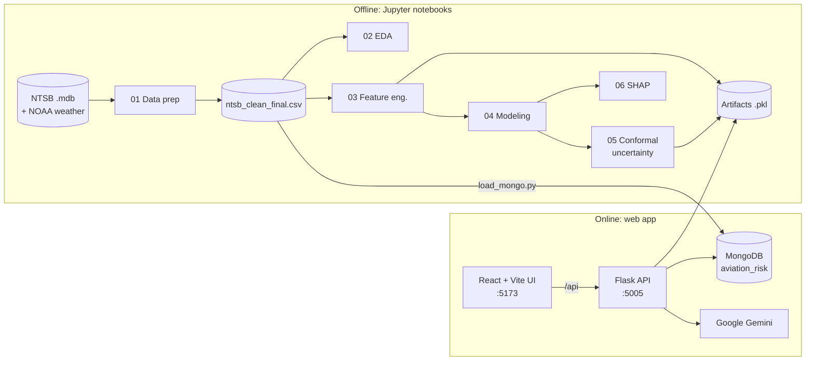
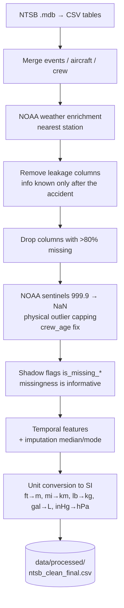
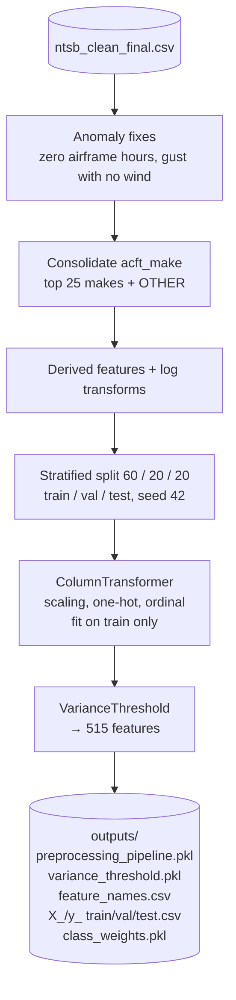
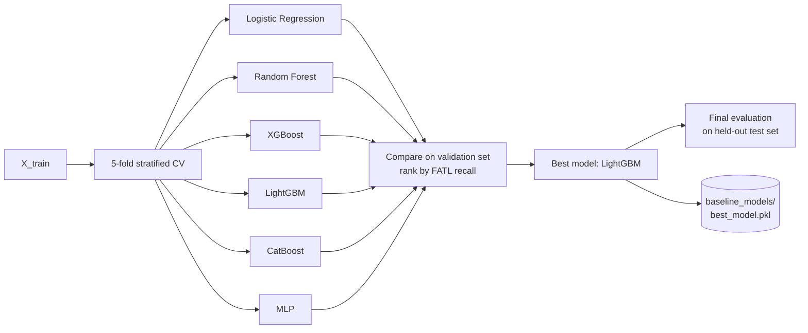
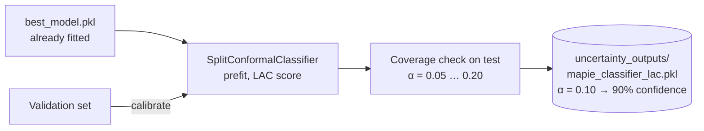
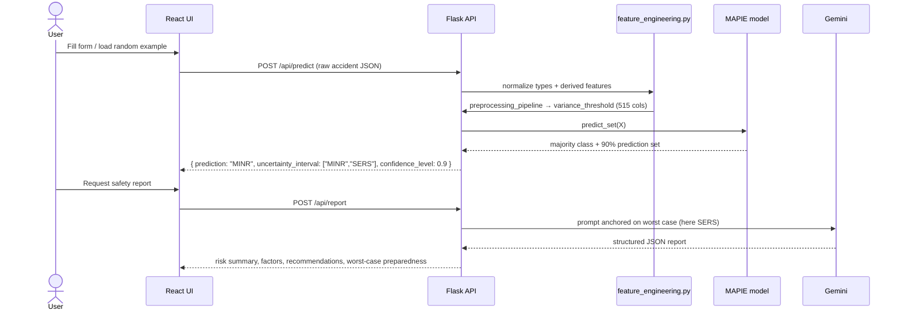

# AeroRisk — Aviation Accident Severity Prediction

AeroRisk predicts **how severe an aviation accident is likely to be** from the conditions around it: aircraft, crew, flight and weather. It is trained on NTSB accident records enriched with NOAA weather data.

Instead of returning a single guess, the model returns a **prediction set with a statistical guarantee**: *"with 90% confidence, the outcome is in {SERS, FATL}"*. A Google Gemini LLM then writes a safety report for that prediction, based on the **worst case** in the set.

| Class  | Meaning                    |
|--------|----------------------------|
| `NONE` | No injuries                |
| `MINR` | Minor injuries             |
| `SERS` | Serious injuries           |
| `FATL` | At least one fatality      |

The main metric is **FATL recall**, because missing a fatal case costs more than raising a false alarm.

---

## Table of contents

1. [Architecture overview](#architecture-overview)
2. [Repository layout](#repository-layout)
3. [The ML pipeline, step by step](#the-ml-pipeline-step-by-step)
4. [How a prediction is served](#how-a-prediction-is-served)
5. [Results](#results)
6. [Getting started](#getting-started)
7. [API reference](#api-reference)
8. [Configuration](#configuration)
9. [Troubleshooting](#troubleshooting)

---

## Architecture overview



- **Notebooks** clean the data, train the model and save the artifacts as files.
- **Flask backend** loads those artifacts at startup. It serves predictions, historical statistics (from MongoDB) and Gemini reports.
- **React frontend** has three tabs: **Prediction**, **Exploration** (dataset statistics) and **Diagnostic** (health of the model, DB and Gemini).

---

## Repository layout

```
anomalyDetection/
├── data/processed/ntsb_clean_final.csv   # cleaned dataset (output of NB01)
├── notebooks/
│   ├── 01_data_preparation.ipynb         # cleaning, imputation, SI units
│   ├── 02_eda_visualisation.ipynb        # exploratory analysis → outputs/eda/
│   ├── 03_feature_engineering.ipynb      # derived features, split, preprocessing pipeline
│   ├── 04_modeling.ipynb                 # 6 models, CV, best model selection
│   ├── 05_uncertainty_lac.ipynb          # MAPIE conformal prediction (LAC score), used by the API
│   ├── 05_uncertainty.ipynb              # earlier variant of the uncertainty notebook
│   ├── 06_shap_explainability.ipynb      # SHAP interpretation
│   ├── outputs/                          # preprocessing pipeline, splits, feature names
│   ├── baseline_models/                  # trained models, comparison plots
│   ├── uncertainty_outputs/              # MAPIE classifier, coverage plots
│   └── shap_outputs/                     # SHAP values and plots
├── backend/backend/
│   ├── app.py                            # Flask app factory (port 5005)
│   ├── config/settings.py                # locates project root / artifact paths
│   ├── routes/                           # predict, report, historical blueprints
│   ├── services/                         # prediction, mongo, gemini services
│   ├── utils/feature_engineering.py      # same feature logic as NB03, for live requests
│   ├── scripts/load_mongo.py             # loads the CSV into MongoDB
│   └── .env.example
└── frontend/frontend/                    # React 18 + TypeScript + Vite + Recharts
```

---

## The ML pipeline, step by step

Run the notebooks in order. Each one reads the previous one's outputs.

### Step 1 — Data preparation (`01_data_preparation.ipynb`)

Merges the NTSB tables, joins NOAA weather from the nearest station, and produces a clean, leakage-free dataset (~29,000 accidents).



> Sections 1 and 3 (Access `.mdb` extraction and NOAA download, ~30 min) are commented out. They only need to run once. The notebook has a fast path that loads already-merged data.

### Step 2 — Exploratory analysis (`02_eda_visualisation.ipynb`)

Covers the target distribution, numeric and categorical distributions, correlations, bivariate and multivariate views (weather, wind/light, crew age vs. severity), temporal trends and geography. All plots go to `notebooks/outputs/eda/`.

### Step 3 — Feature engineering (`03_feature_engineering.ipynb`)



### Step 4 — Modeling (`04_modeling.ipynb`)



The models use class weights to handle class imbalance.

### Step 5 — Conformal uncertainty (`05_uncertainty_lac.ipynb`)

This wraps the best model with **MAPIE split conformal prediction** using the LAC score. The validation set is the calibration set. For a chosen error rate α, the prediction set is guaranteed to contain the true class with probability ≥ 1 − α.



The notebook also looks at *when* the model is uncertain, for example by weather and by distance to the NOAA station.

### Step 6 — Explainability (`06_shap_explainability.ipynb`)

`shap.TreeExplainer` on LightGBM gives global importance (bar and beeswarm plots), dependence plots for the top features, and waterfall explanations for one FATL case and one NONE case. The outputs are in `notebooks/shap_outputs/`.

---

## How a prediction is served



Key design points:

- **Same transforms in training and serving.** `backend/backend/utils/feature_engineering.py` repeats NB03's feature logic. The fitted pipeline is loaded straight from `notebooks/outputs/`, so re-running the notebooks and restarting the backend is enough to update the API.
- **Worst-case reporting.** The Gemini report is based on the most severe class in the prediction set, not the most likely one. This follows the precautionary principle used in aviation.
- **No test-data leakage in the dashboard.** `load_mongo.py` repeats the NB03 split and tags each document with `split`. Every MongoDB query adds the filter `split != "test"`.
- **Fallback.** If `mapie_classifier_lac.pkl` is missing, the API uses `best_model.pkl` and returns a single-class set.

---

## Results

Validation set, from `notebooks/baseline_models/val_comparison.csv`:

| Model               | Macro F1 | Accuracy | AUC   | FATL F1 | **FATL recall** |
|---------------------|---------:|---------:|------:|--------:|----------------:|
| **LightGBM**        | 0.648    | 0.705    | 0.868 | 0.896   | **0.877**       |
| XGBoost             | 0.655    | 0.712    | 0.873 | 0.893   | 0.875           |
| CatBoost            | 0.602    | 0.637    | 0.840 | 0.881   | 0.869           |
| Logistic Regression | 0.564    | 0.603    | 0.813 | 0.852   | 0.867           |
| Random Forest       | 0.650    | 0.771    | 0.879 | 0.888   | 0.865           |
| MLP                 | 0.607    | 0.695    | 0.821 | 0.864   | 0.862           |

Conformal coverage, from `notebooks/uncertainty_outputs/coverage_results.csv`:

| α    | Target coverage | Empirical coverage | Mean set size | Single-class sets |
|------|----------------:|-------------------:|--------------:|------------------:|
| 0.05 | 95%             | 94.9%              | 2.14          | 29%               |
| **0.10** | **90%**     | **89.8%**          | **1.75**      | **43%**           |
| 0.15 | 85%             | 84.5%              | 1.49          | 57%               |
| 0.20 | 80%             | 79.3%              | 1.29          | 72%               |

The API uses α = 0.10.

Top SHAP features for FATL: `crew_tox_perf`, `is_missing_fuel_on_board`, `afm_hrs_since`, `wx_src_iic`, `latlong_acq`, `fuel_on_board_l_log`.

---

## Getting started

### Prerequisites

| Tool        | Version                         |
|-------------|---------------------------------|
| Python      | 3.11                            |
| Node.js     | 18+ (with npm)                  |
| MongoDB     | running on `localhost:27017`    |
| Gemini key  | optional, only for `/api/report` ([Google AI Studio](https://aistudio.google.com/)) |

The commands below use **Windows PowerShell** from the repository root. Bash equivalents are given where they differ.

### 1. Create the Python environment

```powershell
python -m venv anomaly_venv
.\anomaly_venv\Scripts\Activate.ps1          # bash: source anomaly_venv/Scripts/activate  (Linux/macOS: anomaly_venv/bin/activate)

pip install flask flask-cors python-dotenv pymongo google-generativeai `
            pandas numpy scikit-learn joblib "mapie>=1.0" `
            lightgbm xgboost catboost shap matplotlib seaborn jupyter
```

> **Note:** the saved conformal model uses MAPIE 1.x (`SplitConformalClassifier`). The `mapie==0.8.6` pin in `backend/backend/requirements.txt` cannot load it. Install `mapie>=1.0` as shown above.

### 2. (Optional) Re-run the ML pipeline

The trained artifacts are already in `notebooks/`. To rebuild them:

```powershell
jupyter lab notebooks
```

Then run `01` → `02` → `03` → `04` → `05_uncertainty_lac` → `06` in order. To run them without opening the UI:

```powershell
cd notebooks
foreach ($nb in "03_feature_engineering","04_modeling","05_uncertainty_lac","06_shap_explainability") {
    jupyter nbconvert --to notebook --execute --inplace "$nb.ipynb"
}
cd ..
```

### 3. Configure the backend

```powershell
cd backend\backend
copy .env.example .env      # bash: cp .env.example .env
```

Edit `.env` and set at least `GEMINI_API_KEY` if you want AI reports. See [Configuration](#configuration).

### 4. Load the dataset into MongoDB

Do this once, and again whenever `ntsb_clean_final.csv` changes:

```powershell
# from backend\backend
python scripts\load_mongo.py
```

This writes about 29k documents to `aviation_risk.accidents`, each tagged with `split` = train / val / test.

### 5. Start the backend

```powershell
# from backend\backend
python app.py
```

The API runs on **http://localhost:5005**. Check it with:

```powershell
curl http://localhost:5005/api/health
```

### 6. Start the frontend (new terminal)

```powershell
cd frontend\frontend
npm install       # first time only
npm run dev
```

Open **http://localhost:5173**. On the Prediction tab you can load a random historical example, run a prediction and generate a Gemini report.

To build for production:

```powershell
npm run build     # output in frontend/frontend/dist
npm run preview
```

---

## API reference

Base URL: `http://localhost:5005/api`

| Method | Endpoint                               | Description |
|--------|----------------------------------------|-------------|
| GET    | `/health`                              | Shows whether the model, preprocessor, MongoDB and Gemini are available |
| POST   | `/predict`                             | Raw accident JSON (schema of `ntsb_clean_final.csv`) → prediction + 90% set |
| POST   | `/report`                              | Prediction + set + features → Gemini safety report |
| GET    | `/historical/stats`                    | Total accidents, years covered, number of states |
| GET    | `/historical/distribution?field=<f>`   | Counts per value. `f` must be one of: `ev_state`, `ev_type`, `acft_make`, `acft_category`, `phase_flt_spec`, `weather`, `light_cond`, `damage`, `type_fly`, `far_part`, `num_eng`, `ev_month`, `ev_year` |
| GET    | `/historical/timeseries`               | Monthly accident counts |
| GET    | `/historical/risk-breakdown`           | Counts of NONE / MINR / SERS / FATL |
| GET    | `/historical/accidents`                | Sample of raw records |
| GET    | `/historical/random-example`           | One random non-test record, ready to send to `/predict` |

All `/historical/*` endpoints exclude test-split data.

**Example: predict on a random historical record**

```powershell
$ex = (Invoke-RestMethod http://localhost:5005/api/historical/random-example).data
Invoke-RestMethod http://localhost:5005/api/predict -Method Post `
    -ContentType "application/json" -Body ($ex | ConvertTo-Json -Depth 5)
```

```bash
curl -s http://localhost:5005/api/historical/random-example | jq '.data' \
  | curl -s -X POST http://localhost:5005/api/predict -H "Content-Type: application/json" -d @-
```

Response:

```json
{
  "status": "success",
  "prediction": "MINR",
  "confidence_level": 0.9,
  "uncertainty_interval": ["MINR", "SERS"]
}
```

---

## Configuration

`backend/backend/.env`:

| Variable         | Default                       | Purpose |
|------------------|-------------------------------|---------|
| `MONGO_URI`      | `mongodb://localhost:27017/`  | MongoDB connection |
| `MONGO_DB_NAME`  | `aviation_risk`               | Database name |
| `GEMINI_API_KEY` | —                             | Turns on `/api/report` |
| `GEMINI_MODEL`   | `gemini-3.1-flash-lite`       | Gemini model name |
| `FRONTEND_URL`   | `http://localhost:5173`       | CORS allowed origin |
| `PORT`           | `5005`                        | API port |
| `FLASK_DEBUG`    | `1`                           | Debug mode |
| `PROJECT_ROOT`   | auto-detected                 | Set this if the backend can't find the `notebooks/` folder |

Frontend: set `VITE_API_URL` (default `http://localhost:5005/api`) in `frontend/frontend/.env` to point the UI at another backend.

---

## Troubleshooting

| Symptom | Fix |
|---------|-----|
| `Racine du projet introuvable` on startup | The backend couldn't find `notebooks/`. Set `PROJECT_ROOT` in `.env` to the absolute repository path. |
| Error unpickling `mapie_classifier_lac.pkl` | Install `mapie>=1.0`, and the same scikit-learn / LightGBM versions used to train the model. |
| Exploration tab is empty or shows an error | Check that MongoDB is running and that you ran `scripts/load_mongo.py`. |
| `/api/report` returns `SERVICE_UNAVAILABLE` | `GEMINI_API_KEY` is missing or invalid in `.env`. |
| CORS errors in the browser | `FRONTEND_URL` must match the URL the UI is served from. |

---

## Tech stack

**ML:** pandas, scikit-learn, LightGBM, XGBoost, CatBoost, MAPIE, SHAP · **Backend:** Flask, PyMongo, Google Generative AI · **Frontend:** React 18, TypeScript, Vite, Recharts · **Data:** NTSB aviation accident database, NOAA weather observations
